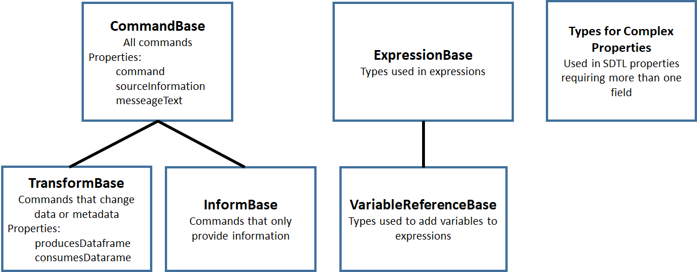
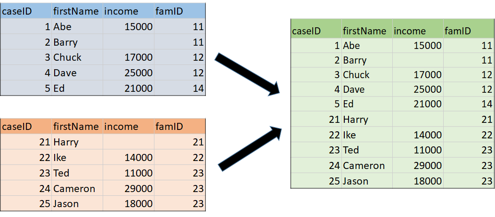
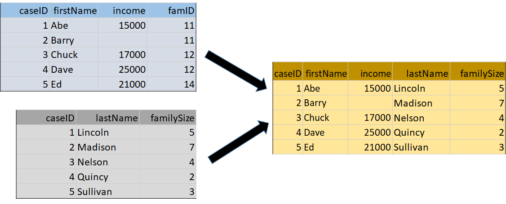
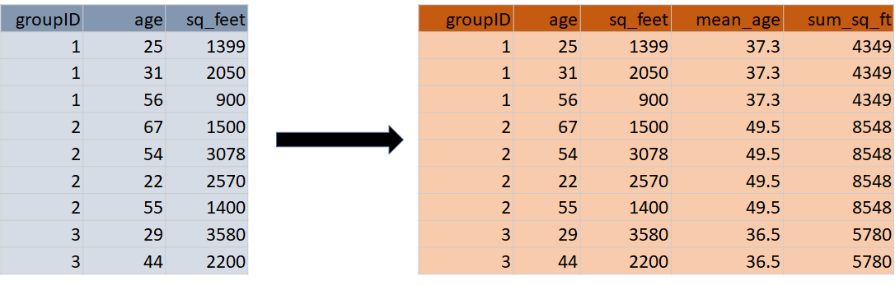
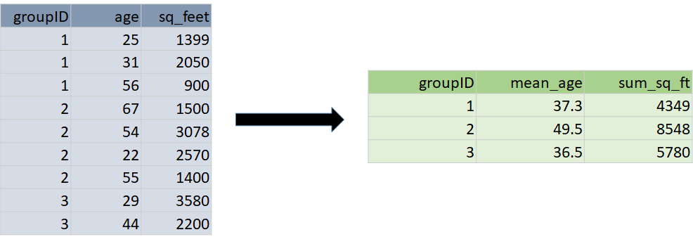

SDTL Command Language [1]_
==========================

Overview
--------

SDTL has been defined as a set of JSON (JavaScript Object Notation)
schemas. Each schema is a “type” (“$type” in the schemas), which can
include one or more “properties”. Properties are described by name/value
pairs. The value of a property may be another SDTL type, and SDTL types
are often nested in this way. A value may also be an array, which is an
ordered list of values. However, all values are ultimately resolved into
numbers, text strings, or boolean constants (True/False).

Figure 2 gives an example illustrating how SDTL types are nested inside
other types. The source command is "RENAME VARIABLES (var10 = Age).“,
which changes the name of variable “var10” to “Age” in the SPSS
language. The corresponding SDTL command is **Rename**, which is given
in both the “$type” and “command” properties in Figure 1. The original
SPSS version is given in the **originalSourceText** of the
**sourceInformation** property. The SDTL **Rename** command has only one
property, **renames**, which can include one or more values of type
**RenamePair**. In this case, we have only one **RenamePair**, which has
two properties **oldVariable** and **newVariable**, each of which must
be a **VariableSymbolExpression** type. A **VariableSymbolExpression**
has only one property, **VariableName**, which must be a string. These
strings are the old and new names for the variable, “var10” and “Age”.

SDTL is much more verbose than the SPSS version of the same command, but
SDTL is much easier for a computer to manipulate. Every element in SDTL
has a “$type” explaining where it fits in the SDTL schema. [2]_ We know
that “var10” is the old variable name, because it is tagged with
**oldVariable**. In contrast, a computer program would need to include
code reproducing the syntax rules of the SPSS language to identify
“var10” as the variable to be renamed in the original SPSS command.

Documentation and downloads for the SDTL Command Language are available
at http://c2metadata.gitlab.io/sdtl-docs/. The COGS documentation system
provides detailed descriptions of all SDTL types, and some descriptions
are supplemented with examples and other documents.

Figure 2. Example SDTL: Rename command

.. code:: json

    {
        "$type": "Rename",
        "command": "rename",
        "sourceInformation": {
            "originalSourceText": "RENAME VARIABLES (var10 = Age)."
        },
        "renames": [
            {
                "$type": "RenamePair",
                "oldVariable": {
                    "variableName": "var10",
                    "$type": "VariableSymbolExpression"

                },
                "newVariable": {
                    "variableName": "Age",
                    "$type": "VariableSymbolExpression"
                }
            }
        ]
    }

SDTL Type Hierarchy
-------------------

Types in SDTL are organized into groups, called “bases”, according to
the hierarchy shown in Figure 3.

Figure 3. Type Hierarchy in SDTL

CommandBase
~~~~~~~~~~~

The SDTL types in CommandBase describe actions, like merging files or
modifying the contents of a variable. CommandBase has two
sub-categories:

-  TransformBase includes commands that change data or metadata, like
   **Compute**, **Rename**, **MergeDatasets**, and **SetDataType**

-  InformBase commands provide information, like **Comment** and
   **Message**

All commands inherit properties from CommandBase (**command**,
**sourceInformation**, and **messageText**).

TransformBase
~~~~~~~~~~~~~

The types belonging to TransformBase are commands that change data or
metadata. All commands in TransformBase also inherit properties from
CommandBase to which it belongs:

+-----------------------+---------------------------------------------+
| **producesDataframe** | Identifies the dataframes which this        |
|                       | transform produces.                         |
+-----------------------+---------------------------------------------+
| **consumesDataframe** | Identifies the dataframes which this        |
|                       | transform acts upon.                        |
+-----------------------+---------------------------------------------+

In Table 1 the commands in TransformBase are arranged into five
functional sub-groups.

1. Commands that create variables or change the values of a variable.
   Only four SDTL commands add or modify variables.

2. Commands that change the metadata associated with a variable or
   dataframe.
   Statistical packages manage several types of metadata: variable
   names, labels, data type, display properties.

3. Commands that read or write files.

4. Commands that change the structure of a dataframe.
   The structure of a dataframes is changed by adding or dropping
   columns or rows.

5. Commands that control the flow of operations in a script
   Command execution can be conditional (if.. then..else) or iterative.

InformBase
----------

Table 2 shows informational commands that do not describe changes to the
data. Although SDTL does not include commands that analyze data, these
commands can be transcribed verbatim in an SDTL script with the
**Analysis** command. **Unsupported** is used for commands that our
Parser cannot translate into SDTL. **Invalid** is used when the parser
recognizes the command in the source language but its syntax does not
conform to expectations. **NoTransformOp** is used for source language
commands that do not have a function in SDTL, like invoking a library of
functions in the source language.

ExpressionBase
--------------

The SDTL types in Table 3 (ExpressionBase) are used in expressions,
which may be numeric, text or logical. The most powerful of these types
is **FunctionCallExpression**, which is discussed below.
VariableReferenceBase (Table 4) is a subcategory of ExpressionBase used
to describe the variables in an expression.

ExpressionBase includes types to describe lists and ranges of variables,
numbers, and strings. Commands like **Recode** and **SetDataFormat** are
often applied to many variables at the same time. The
**VariableRangeExpression** identifies variables in contiguous columns
in the dataframe by specifying the first and last variables in the set.
A **VariableListExpression** consists of a list of individual variables
(**VariableSymbolExpression**) and ranges (**VariableRangeExpression**).

Commands and functions may also require a list of values, like the
**cut_list()** function which divides a numeric variable into categories
at specified breakpoints. A **ValueListExpression** may consist of
numbers or strings (**NumericConstantExpression**,
**StringConstantExpression**) or ranges of numbers or strings
(**NumberRangeExpression**, **StringRangeExpression**). In SDTL a list
of values is a single expression, which simplifies the description of
functions.

Types for Complex Properties
----------------------------

Table 5 includes types that were created to represent complex properties
of other commands. For example, **SourceInformation** is a property of
every command in CommandBase that shows the source of this command in
its original language. In addition to the text of the original command,
**SourceInformation** provides the location of the original command in
the command script. **SourceInformation** has the following properties.

-  **lineNumberStart**: The line number of the beginning of the
   transform code

-  **lineNumberEnd**: The line number of the end of the transform code

-  **sourceStartIndex**: The character index of the beginning of the
   transform code

-  **sourceStopIndex**: The character index of the end of the transform
   code

-  **originalSourceText**: The original source code of the data
   transform code

-  **processedSourceText**: The source code of the data transform code
   after processing macros or loops

Although **sourceInformation** is only one property of a command, the
**SourceInformation** type allows it to include six types of
information.

+----------------------------------+----------------------------------+
| **Table 1**                                                         |
|   **TransformBase: SDTL Types that Change a Dataframe**             |
+----------------------------------+----------------------------------+
| \A. Commands that create                                            |
| variables or change the                                             |
| values of a variable                                                |
+----------------------------------+----------------------------------+
| **Aggregate**                    | An aggregation summarizes data   |
|                                  | using aggregation functions      |
|                                  | applied to data that may be      |
|                                  | grouped by one or more           |
|                                  | variables. The resulting summary |
|                                  | data is added to each row of the |
|                                  | existing dataset. The SDTL       |
|                                  | Collapse command is used when    |
|                                  | the summary data is used to      |
|                                  | create a new dataframe with one  |
|                                  | row per group..                  |
+----------------------------------+----------------------------------+
| **Compute**                      | Assigns the value of an          |
|                                  | expression to a variable.        |
+----------------------------------+----------------------------------+
| **Recode**                       | Describes recoding values in one |
|                                  | or more variables according to a |
|                                  | specified mapping. The Recode    |
|                                  | command can either describe a    |
|                                  | recoding of one or more          |
|                                  | individual variables, or a range |
|                                  | of variables. When one or more   |
|                                  | individual variables are         |
|                                  | described, a new variable name   |
|                                  | can be specified. In this case,  |
|                                  | the original variable is left    |
|                                  | alone, and a new variable is     |
|                                  | created with the recoded values. |
+----------------------------------+----------------------------------+
| **SetMissingValues**             | Defines values that are treated  |
|                                  | as missing values for a list of  |
|                                  | variables.                       |
+----------------------------------+----------------------------------+
|                                  |                                  |
+----------------------------------+----------------------------------+
| \B. Commands that change the                                        |
| metadata associated with a                                          |
| variable or dataframe                                               |
+----------------------------------+----------------------------------+
| **Rename**                       | Rename changes the name of a     |
|                                  | variable or list of variables.   |
+----------------------------------+----------------------------------+
| **SetDatasetProperty**           | Changes a property of a          |
|                                  | dataframe.                       |
+----------------------------------+----------------------------------+
| **SetDataType**                  | Sets the data type of a variable |
|                                  | or list of variables.            |
+----------------------------------+----------------------------------+
| **SetDisplayFormat**             | Sets the display or output       |
|                                  | format for a variable or list of |
|                                  | variables.                       |
+----------------------------------+----------------------------------+
| **SetValueLabels**               | Describes the assignment of      |
|                                  | labels to categorical values.    |
+----------------------------------+----------------------------------+
| **SetVariableLabel**             | Describes the assignment of a    |
|                                  | label to a variable.             |
+----------------------------------+----------------------------------+
|                                  |                                  |
+----------------------------------+----------------------------------+
| \C. Commands that read or write                                     |
| files                                                               |
+----------------------------------+----------------------------------+
| **Load**                         | Load data from a file.           |
+----------------------------------+----------------------------------+
| **Save**                         | Writes a dataset to a file.      |
+----------------------------------+----------------------------------+
|                                  |                                  |
+----------------------------------+----------------------------------+
| \D. Commands that change the                                        |
| structure of a dataframe                                            |
+----------------------------------+----------------------------------+
| **AppendDatasets**               | Combines datasets by             |
|                                  | concatenation for datasets with  |
|                                  | the same or overlapping          |
|                                  | variables.                       |
+----------------------------------+----------------------------------+
| **Collapse**                     | A collapse command summarizes    |
|                                  | data using aggregation functions |
|                                  | applied to data that may be      |
|                                  | grouped by one or more           |
|                                  | variables. The resulting summary |
|                                  | data is represented in a new     |
|                                  | dataset. See Aggregate for       |
|                                  | adding summary variables without |
|                                  | changing the number of rows.     |
+----------------------------------+----------------------------------+
| **DropCases**                    | Rows that match the selection    |
|                                  | condition are deleted in the     |
|                                  | dataset. Other rows are          |
|                                  | retained.                        |
+----------------------------------+----------------------------------+
| **DropVariables**                | Deletes variables from the       |
|                                  | dataset.                         |
+----------------------------------+----------------------------------+
| **KeepCases**                    | Rows that match the selection    |
|                                  | condition are retained in the    |
|                                  | dataset. Other rows are deleted. |
+----------------------------------+----------------------------------+
| **KeepVariables**                | Variables to be retained in the  |
|                                  | dataset. Variables not on the    |
|                                  | list are deleted.                |
+----------------------------------+----------------------------------+
| **MergeDatasets**                | Merges datasets holding          |
|                                  | overlapping cases but different  |
|                                  | variables. The merge may be      |
|                                  | controlled by keys or grouping   |
|                                  | variables.                       |
+----------------------------------+----------------------------------+
| **NewDataframe**                 | Creates a new empty dataframe.   |
|                                  | Numbers of rows or columns may   |
|                                  | be specified. All values are     |
|                                  | assumed to be missing.           |
+----------------------------------+----------------------------------+
| **ReshapeLong**                  | Creates a new dataset with       |
|                                  | multiple rows per case by        |
|                                  | assigning a set of variables in  |
|                                  | the original dataset to a single |
|                                  | variable in the new dataset.     |
+----------------------------------+----------------------------------+
| **ReshapeWide**                  | ReshapeWide is not supported in  |
|                                  | the current version of SDTL,     |
|                                  | because it depends on values in  |
|                                  | the data. However, it may be     |
|                                  | useful when values of the index  |
|                                  | variable are available in the    |
|                                  | metadata file or the data can be |
|                                  | processed.                       |
+----------------------------------+----------------------------------+
| **SortCases**                    | Sorts rows in the dataframe in a |
|                                  | specified order.                 |
+----------------------------------+----------------------------------+
|                                  |                                  |
+----------------------------------+----------------------------------+
| \E. Commands that control the                                       |
| flow of operations in a script                                      |
+----------------------------------+----------------------------------+
| **DoIf**                         | A set of commands that are       |
|                                  | performed when a logical         |
|                                  | expression is true. May also     |
|                                  | include ElseCommands to be       |
|                                  | performed if the logical         |
|                                  | expression is false. The         |
|                                  | commands in DoIf are performed   |
|                                  | once, and it expects a logical   |
|                                  | condition that applies to the    |
|                                  | entire dataframe. Use IfRows for |
|                                  | commands that are performed on   |
|                                  | each row depending upon values   |
|                                  | on those rows.                   |
+----------------------------------+----------------------------------+
| **Execute**                      | This command causes the system   |
|                                  | to execute preceding commands    |
|                                  | before continuing to process the |
|                                  | command script.                  |
+----------------------------------+----------------------------------+
| **IfRows**                       | A set of commands that are       |
|                                  | performed on each row in the     |
|                                  | dataframe when a logical         |
|                                  | expression is true for that row. |
|                                  | May also include ElseCommands to |
|                                  | be performed if the logical      |
|                                  | expression is false. Use DoIf    |
|                                  | for a logical condition that     |
|                                  | applies to the entire dataframe  |
|                                  | and commands that are performed  |
|                                  | once.                            |
+----------------------------------+----------------------------------+
| **LoopOverList**                 | A loop creates multiple versions |
|                                  | of a set of commands by          |
|                                  | iterating over a list of         |
|                                  | variables, numbers, or strings.  |
+----------------------------------+----------------------------------+
| **LoopWhile**                    | LoopWhile iterates over a set of |
|                                  | commands under the control of    |
|                                  | one or more logical expressions. |
|                                  | Since the logical conditions     |
|                                  | typically depend upon values in  |
|                                  | the data, commands executed in a |
|                                  | LoopWhile cannot be anticipated  |
|                                  | and expanded in SDTL.            |
+----------------------------------+----------------------------------+

+----------------------------------+----------------------------------+
| **Table 2.**                                                        |
|   **InformBase: Commands that provide information**                 |
+----------------------------------+----------------------------------+
| **Analysis**                     | Describes an analysis command.   |
|                                  | An analysis command does not     |
|                                  | result in any data               |
|                                  | transformation.                  |
+----------------------------------+----------------------------------+
| **Comment**                      | Describes a source code comment. |
+----------------------------------+----------------------------------+
| **Invalid**                      | Describes an invalid command. A  |
|                                  | command is invalid if it uses    |
|                                  | incorrect syntax, or is          |
|                                  | otherwise not allowed by the     |
|                                  | executing system.                |
+----------------------------------+----------------------------------+
| **Message**                      | Inserts message text in the SDTL |
|                                  | file.                            |
+----------------------------------+----------------------------------+
| **NoTransformOp**                | NoTransformOp is used for a      |
|                                  | command in the original script   |
|                                  | that provides important          |
|                                  | information but does not have a  |
|                                  | function in SDTL. For example,   |
|                                  | “library()” in R loads a package |
|                                  | of R functions. Since the Parser |
|                                  | detects the library, the SDTL    |
|                                  | will reflect the library that is |
|                                  | used, and commands derived from  |
|                                  | the library will be translated   |
|                                  | in the SDTL script. However, it  |
|                                  | is useful to know which library  |
|                                  | is active for auditing the R     |
|                                  | script, even if it does not      |
|                                  | perform any data                 |
|                                  | transformations.                 |
+----------------------------------+----------------------------------+
| **Unsupported**                  | Describes an unsupported         |
|                                  | command. An unsupported command  |
|                                  | is valid syntax, but not         |
|                                  | supported by the parsing         |
|                                  | application.                     |
+----------------------------------+----------------------------------+

+--------------------------------------+----------------------------------+
| **Table 3.**                                                            |
|   **ExpressionBase: SDTL Types Used in Expressions**                    |
+--------------------------------------+----------------------------------+
| **BooleanConstantExpression**        | BooleanConstantExpression takes  |
|                                      | values of TRUE and FALSE.        |
+--------------------------------------+----------------------------------+
| **FunctionCallExpression**           | An expression evaluated by       |
|                                      | reference to the Function        |
|                                      | Library.                         |
+--------------------------------------+----------------------------------+
| **GroupedExpression**                | A group of expressions to be     |
|                                      | evaluated before expressions     |
|                                      | outside of the group. Used to    |
|                                      | control the order of operations  |
|                                      | in a formula.                    |
+--------------------------------------+----------------------------------+
| **IteratorSymbolExpression**         | The name of an iterator symbol   |
|                                      | used as an index in describing   |
|                                      | the actions of a loop.           |
+--------------------------------------+----------------------------------+
| **MissingValueConstantExpression**   | A missing value constant. Some   |
|                                      | languages allow multiple missing |
|                                      | value constants.                 |
+--------------------------------------+----------------------------------+
| **NumberRangeExpression**            | Defines a range of numeric       |
|                                      | values.                          |
+--------------------------------------+----------------------------------+
| **NumericConstantExpression**        | A numeric constant.              |
+--------------------------------------+----------------------------------+
| **NumericMaximumValueExpression**    | Represents the largest numeric   |
|                                      | value supported by a system.     |
+--------------------------------------+----------------------------------+
| **NumericMinimumValueExpression**    | Represents the smallest numeric  |
|                                      | value supported by a system.     |
+--------------------------------------+----------------------------------+
| **StringConstantExpression**         | A text string.                   |
+--------------------------------------+----------------------------------+
| **StringRangeExpression**            | Defines a range of string        |
|                                      | values.                          |
+--------------------------------------+----------------------------------+
| **UnhandledValuesExpression**        | Represents any values not        |
|                                      | previously handled (for example, |
|                                      | in a set of recode rules).       |
+--------------------------------------+----------------------------------+
| **ValueListExpression**              | Wraps a list of other            |
|                                      | expressions.                     |
+--------------------------------------+----------------------------------+
| **VariableReferenceBase**            | SDTL types used to describe      |
|                                      | variables. See Table 3.          |
+--------------------------------------+----------------------------------+

+-------------------------------------+----------------------------------+
| **Table 4.**                                                           |
|   **VariableReferenceBase: SDTL Types Used to Describe Variables**     |
|   **in Expressions**                                                   |
+-------------------------------------+----------------------------------+
| **AllNumericVariablesExpression**   | An expression that represents    |
|                                     | all numeric variables in the     |
|                                     | dataset, similar to \`_all\` in  |
|                                     | SPSS or Stata.                   |
+-------------------------------------+----------------------------------+
| **AllTextVariablesExpression**      | An expression that represents    |
|                                     | all text variables in the        |
|                                     | dataset, similar to \`_all\` in  |
|                                     | SPSS or Stata.                   |
+-------------------------------------+----------------------------------+
| **AllVariablesExpression**          | An expression that represents    |
|                                     | all variables in the dataset,    |
|                                     | similar to \_all in SPSS or      |
|                                     | Stata.                           |
+-------------------------------------+----------------------------------+
| **CompositeVariableNameExpression** | A composite variable name is     |
|                                     | used to describe a variable name |
|                                     | that is computed.                |
+-------------------------------------+----------------------------------+
| **VariableListExpression**          | A list of variables which may    |
|                                     | include variable names           |
|                                     | (VariableSymbolExpression) and   |
|                                     | variable ranges                  |
|                                     | (VariableRangeExpression).       |
+-------------------------------------+----------------------------------+
| **VariableRangeExpression**         | A list of variables in adjacent  |
|                                     | columns defined by the variable  |
|                                     | names of first and last columns. |
+-------------------------------------+----------------------------------+
| **VariableSymbolExpression**        | A reference to a variable.       |
+-------------------------------------+----------------------------------+

+----------------------------------+----------------------------------+
| **Table 5.**                                                        |
|   **Types for Complex Properties in SDTL Commands**                 |
+----------------------------------+----------------------------------+
| **AppendFileDescription**        | Describes files used in an       |
|                                  | AppendDatasets command.          |
+----------------------------------+----------------------------------+
| **DataframeDescription**         | Describes a dataframe in the     |
|                                  | consumesDataframe or             |
|                                  | producesDataframe types.         |
|                                  | Provides the name of the data    |
|                                  | frame and a list of variables    |
|                                  | (columns). DataframeDescription  |
|                                  | can also define dimensions in    |
|                                  | dataframes that have             |
|                                  | hierarchical indexes, data       |
|                                  | cubes, or multi-indexes.         |
+----------------------------------+----------------------------------+
| **FunctionArgument**             | Describes the arguments in a     |
|                                  | function as specified in the     |
|                                  | SDTL Function Library.           |
+----------------------------------+----------------------------------+
| **IteratorDescription**          | Describes an iteration process   |
|                                  | consisting of an                 |
|                                  | IteratorSymbolExpression and a   |
|                                  | list of values it takes.         |
+----------------------------------+----------------------------------+
| **MergeFileDescription**         | Describes files used in a        |
|                                  | MergeDatasets command.           |
+----------------------------------+----------------------------------+
| **RecodeRule**                   | Describes how values will be     |
|                                  | recoded.                         |
+----------------------------------+----------------------------------+
| **RecodeVariable**               | Describes a variable that will   |
|                                  | have its values recoded.         |
+----------------------------------+----------------------------------+
| **RenamePair**                   | Variable names before and after  |
|                                  | a variable is renamed.           |
+----------------------------------+----------------------------------+
| **ReshapeItemDescription**       | Describes a new variable created |
|                                  | by reshaping a dataset from wide |
|                                  | to long.                         |
+----------------------------------+----------------------------------+
| **SortCriterion**                | Describes a criterion by which   |
|                                  | cases are sorted, including the  |
|                                  | variable name and whether to     |
|                                  | sort ascending or descending.    |
+----------------------------------+----------------------------------+
| **SourceInformation**            | SourceInformation defines        |
|                                  | information about the original   |
|                                  | source of a data transform.      |
+----------------------------------+----------------------------------+
| **ValueLabel**                   | Associates a label with a value  |
|                                  | in a categorical variable.       |
+----------------------------------+----------------------------------+

A command in a source language may result in several SDTL commands. For
example, in some languages the cut() function, which divides a numeric
variable into categories, can also apply labels to the resulting
categories. The equivalent SDTL function does not include a way to
define value labels, and it would be followed by a separate
**SetValueLabels** command.

Files and Dataframes 
--------------------

SDTL was designed to describe statistical data arranged in a
two-dimensional matrix of rows (cases) and columns (variables). We refer
to data stored on persistent media as ‘files’, and we use ‘dataframe’ to
refer to temporary storage that is available for the duration of a
command script. Files are loaded into temporary storage where they
become dataframes, and dataframes are saved to external storage as
files. A command script may use many files and dataframes.

We use the term “active dataframe” to refer to the dataframe currently
in use by the script. Some statistical packages only use one dataframe
at a time. Other packages set up a working environment in which many
dataframes are accessible. The active dataframe is not always named in
the source script, but a name may be assigned in the SDTL script for
clarification.

**AppendDatasets** and **MergeDatasets** combine rows or columns from
two or more files or dataframes into a new dataframe. **AppendDatasets**
(Figure 4) combines rows from dataframes that share common variables.
**MergeDatasets** (Figure 5) combines columns from dataframes that share
rows referring to the same subjects or entities. 

Figure 4. **AppendDatasets**

Figure 5. **MergeDatasets**

**MergeDatasets** is a particularly complex operation with different 
options in every source language.  Older languages, like SPSS and SAS, 
approach file merging as a process of drawing rows from two files that 
have been pre-sorted.  R and Python use concepts like “right” and “left” 
joins, which are familiar to SQL programmers but opaque to most others.  
SDTL covers old and new source languages by identifying three properties 
defining a wide range of merge procedures.  First, SDTL has a controlled 
vocabulary for the **mergeType**.  A “Sequential” merge matches rows in the 
order that they appear in each file.  A “OneToOne” merge expects each file 
to have one or more identifying variables that uniquely link each row in 
one file to the corresponding row in the other file.  

Second, the **update** property determines the outcome when a variable 
appears in more than one input file.   Some languages use file merging as 
a way of updating data in an existing file.  For example, the merge may be 
designed to supply values for rows with missing values.  In this case, the 
SDTL **update** property of the primary file is set to “Master”, and the 
**update** property of the secondary file is set to “UpdateMissing.”
  
Third, the **newRow** property describes the outcome when a row in one file 
cannot be matched to any of the rows in the other file.  When **newRow** is 
TRUE, a row is added to the output file even if it is not matched.  When 
**newRow** is FALSE, unmatched rows are not included in the output file.  
For “inner” and “outer” joins we set the **newRow** of every file to TRUE or 
FALSE respectively.  “Left” and “right” joins involve one file set to TRUE 
and another file set to FALSE.

The “SDTL Merge Gallery” includes more than thirty examples of merge 
commands in source languages with corresponding SDTL.

**Aggregate** and **Collapse** involve computations across multiple
rows. For example, consider a dataframe consisting of a row for each
child that includes the ID of the mother of each child. If we count rows
by mother’s ID, we get the number of children for each mother. The
**Aggregate** command (Figure 6) retains the existing number of rows and
adds the number of children variable to every child’s row. The
**Collapse** command (Figure 7) results in a new dataframe with one row
per mother.

Figure 6. **Aggregate**

Figure 7. **Collapse**

Conditional Execution by Row or by File/Dataframe
-------------------------------------------------

The execution of a command may depend on a logical condition that is
evaluated sequentially for each row in a dataframe or on a logical
condition that applies to the entire dataframe. For example, a
**Compute** command may be applied only to rows where “varX” is less
than 1000 or it may be applied to all rows when the average of “varX” is
less than 1000. In SDTL **IfRows** is used when the condition is
evaluated and executed separately on each row, and **DoIf** is used when
the condition is evaluated once for the entire dataframe. Both
**IfRows** and **DoIf** can be applied to a group of commands, and both
include an **elseCommands** property for commands to be performed if the
condition is false.

Links to related documents
--------------------------

For data cubes and multi-indexes in SDTL see: 
    :doc:`/Articles/command-language/Hierarchical_Indexing_in_SDTL.rst`

Notes
-----
.. [1]
   In this section SDTL the names of types and properties are given in
   **boldface**. SDTL types begin with uppercase, and properties begin
   with lowercase. Values are surrounded by double quotes (“”).

.. [2]
   As explained in SDTL Best Practices and Conventions #1, the “$type”
   property may be omitted when only one type is allowed.
   
   
   