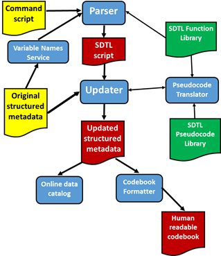

SDTL Use Cases
==============

1. **Data production.** A research organization fields a survey using
   computer assisted interview (CAI) technology. The CAI tools return a
   data file and a corresponding DDI metadata file that completely
   describes the survey instrument. After receiving the data, the
   research organization runs several long SPSS scripts to prepare the
   data for users. Many variables are dropped and recoded, and new
   variables are created by combining existing variables into indexes.
   The research organization uses the C\ :sup:`2`\ Metadata Workflow
   (see below) to produce DDI metadata corresponding to the revised
   data. Changes performed by the SPSS scripts are documented in SDTL.
   SDTL in the updated DDI metadata file links derived variables to the
   original variables from which they were computed. When the data are
   received by a data archive, the DDI is added to the online catalog
   and an interactive codebook.

2. **Replication data.** A researcher downloads data files from public
   repositories with corresponding DDI metadata files. A Stata script
   merges the files and creates new variables combining variables from
   several files. The journal publishing an article based on the merged
   dataset requires authors to deposit the data, program code, and
   documentation explaining the code and the data. The researcher uses
   the C\ :sup:`2`\ Metadata Workflow to produce a codebook with natural
   language descriptions of steps involved in merging the data files and
   creating new variables.

3. **Program operation and variable provenance.** A statistical service
   relies on legacy scripts written in the SAS language to produce
   public data products. When the government changes a reporting
   requirement in the tax code, the service is asked how the new rule
   will affect their data. No one currently working at the service
   understands SAS. Staff translate the SAS script into SDTL and create
   a provenance trace for each variable in the data product. The
   provenance traces identify which variables will be affected by the
   new rule, and they are used by staff to re-write the SAS scripts in
   Python.

The C\ :sup:`2`\ Metadata Workflow
----------------------------------

The C\ :sup:`2`\ Metadata Project has created a suite of tools that form
a complete workflow for creating SDTL and using SDTL to update DDI
metadata files. Rather than relying on a single application, the
C\ :sup:`2`\ Metadata workflow is modular, so that components designed
for different source languages (SPSS, SAS, Stata, R, Python) and
metadata standards (DDI, EML) can be combined. Figure 1 illustrates the
C\ :sup:`2`\ Metadata workflow.

Figure 1. C\ :sup:`2`\ Metadata Workflow

The following objects are illustrated in Figure 1:

Source objects (yellow):

-  *Command script*: A script in a supported language (SPSS, SAS, Stata,
   R, Python) used to transform the original data file

-  *Original structured metadata file*: A metadata file in DDI or
   another standard describing the data file before the command script
   was executed

New objects (red)

-  *SDTL script*: A file in SDTL JSON format translated from the
   *Command script*

-  *Updated structured metadata*: A revised DDI file that corresponds to
   the data file after the Command script was executed, including SDTL
   provenance

-  *Human readable codebook*: A codebook describing the revised data
   file

Applications (blue):

-  *Parser*: An application that reads a Command script and translates
   it into an SDTL script

-  *Variable Names Service*: An application that extracts a list of
   variable names from the DDI metadata file.

-  *Updater*: An application that reads an Original structured metadata
   file and an SDTL script and creates an Updated structured metadata
   file

-  *Pseudocode Translator*: An application that translates SDTL into
   natural language

-  *Online data catalog*: The catalog of a data repository based on DDI
   or a similar standard

-  *Codebook formatter*: An application that reads a metadata file (e.g.
   DDI) and produces documentation about the revised data file

Libraries (green):

-  *SDTL Function Library*: A collection of schemas mapping functions in
   source languages to the corresponding function in SDTL

-  *SDTL Pseudocode Library*: A set of templates for translating SDTL
   into natural language

The workflow begins with the *Parser*, which translates the *Command
script* from its source language into SDTL. The C2Metadata Project has
created parsers for five languages (SPSS, SAS, Stata, R, Python), and
parsers for other languages (e.g. SQL) can be added. The *Parser*
receives an ordered list of variable names in the data file from the
*Variable Names Service*, which extracts them from the Original
structured metadata file. The *Parser* inserts updated variable lists
(SDTL type: DataframeDescription>variableInventory) into the *SDTL
script* as needed. The *Parser* also accesses the *Function Library* for
templates converting functions in the source language into the
corresponding SDTL function. The output of the *Parser* is an *SDTL
script* in JSON format.

The *Updater* uses the *SDTL script* created by the *Parser* to revise
the *Original structured metadata file*. New variables created by the
script are added, and transformations to pre-existing variables are
described. The result is a history of all commands that affected the
current state of each variable. The *Updater* also adds file-level
metadata to reflect commands that drop variables and merge files.
Translations of each command in natural language are also included in
the revised metadata file. The *Updater* sends the *SDTL script* to the
*Pseudocode Translator*, which uses templates in the *Pseudocode
Library* to produce natural language descriptions of SDTL commands.

The *Updated structured metadata* created by the *Updater* retains all
of the metadata from the *Original structured metadata file*. DDI
metadata files can describe more than one data file, and we use that
feature to provide versions of the data file both before and after the
script was executed. This feature allows codebooks and other forms of
documentation to hyper-link data transformation commands to variables
that may have been dropped from the final data file. The *Updater*
assigns a unique ID to every version of a variable in the DDI metadata
file, so that other applications can trace all of the variables used in
data transformation commands.

*Updated structured metadata* can be used in a variety of ways by data
repositories and users. Figure 1 shows two common applications: data
catalogs and codebooks derived from the DDI metadata file.

The tools described in Figure 1 are designed to work as APIs called by a
web interface. In most cases the users interacting with a web interface
will not be aware of the APIs that it invokes. Users may upload a DDI
file and a command script to a web service and then download an SDTL
script, updated DDI, a codebook, and possibly other outputs. SDTL APIs
may also be accessed by other services, like metadata editors and
statistical analysis packages.

Limitations of SDTL and the C\ :sup:`2`\ Metadata Workflow
----------------------------------------------------------

1. SDTL was designed for documentation not execution. SDTL was not
   intended to be complete and precise enough to control execution of a
   program to perform data transformations.

2. SDTL currently focuses on data transformation commands, and it does
   not include schemas for analysis commands that create variables or
   data files. For example, researchers often save predicted values and
   residuals from regression models. Support for data derived from
   analysis commands could be added to SDTL in the future.

3. SDTL currently does not support sorting of variables (columns).
   Statistical packages differ in the lexical ordering used to sort
   columns. A standard way of reporting sort orderings may be added in
   the future.

4. The C\ :sup:`2`\ Metadata workflow is based entirely on metadata, and
   it does not examine the data. This limitation prevents the
   implementation of some data transformations and some DDI features at
   this time.

   a. Reshape long to wide: Reshaping data in long format (e.g.
      children) into a wide format (e.g. mothers) involves creating a
      set of columns for each value of the index variable. Since the
      values of the index variables cannot be known without examining
      the data, reshaping from long to wide is not currently supported
      in C\ :sup:`2`\ Metadata language parsers. However, reshaping from
      wide to long is supported, and SDTL schemas can be used to
      describe long-to-wide commands.

   b. Descriptive statistics. C\ :sup:`2`\ Metadata language parsers do
      not produce descriptive statistics, because they work exclusively
      from metadata. Future software that reads the data as well as the
      metadata should include these features.
